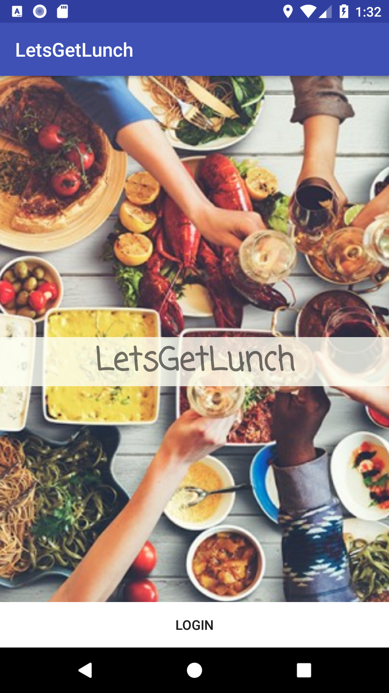
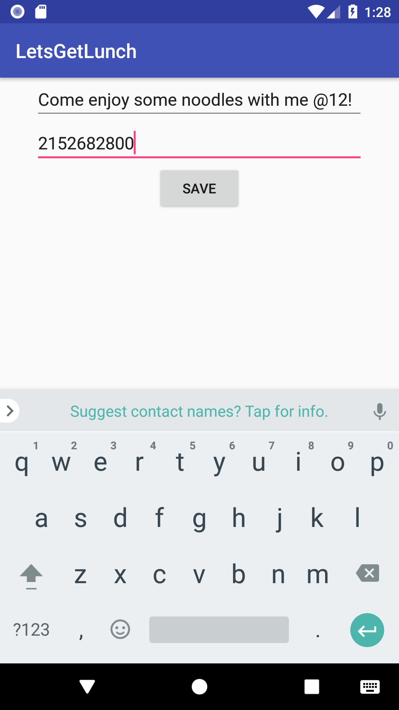
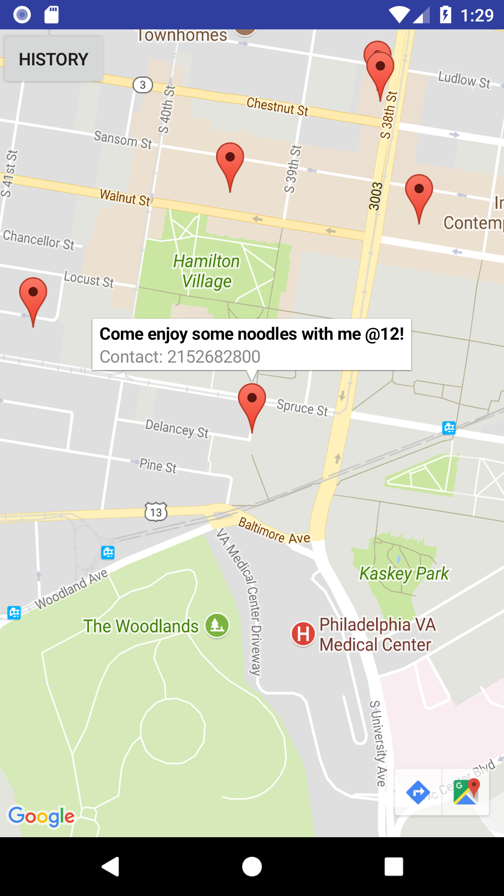

# LetsGetLunch
        
        

Our APP ---- LETSGETLUNCH encourages students at Penn to meet up with their peers during meal time to have a nice conversation with whom who they might have never met before. It enables them to locate friends near them as well.

LETSGETLUNCH is built using Android Studio by us within 10 hours. It is a prototype that asks users to login, stores information in a database, provides a history of the past locations the user has dined in, and of course, allow users to find those who desire meal buddies. The APP pinpoints those who have indicated their interest on Google Map. It shows the phone number of the user and encourages them to contact others directly. Users are able to drop a pin wherever they are at, post a short invite and provide contact information. 

